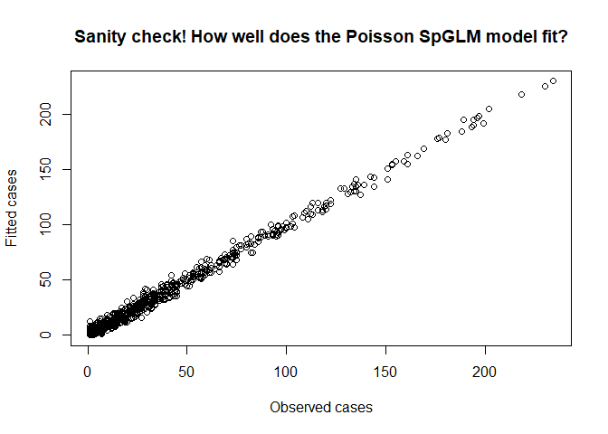
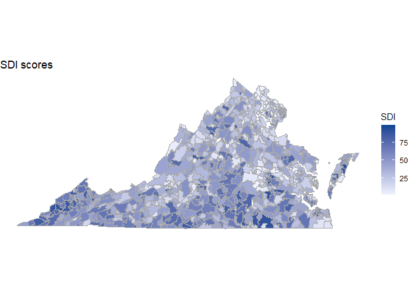

Lung Cancer Incidence in Virginia: A spatial zipcode-level analysis via
INLA
================
Indranil Sahoo
2023-07-16

``` r
# Required Functions

RelativeSquaredError <- function(realized, predicted, na.rm = TRUE){
  error <- realized - predicted
  mean_realized <- mean(realized, na.rm = na.rm)
  sum(error**2, na.rm = na.rm) / sum((realized - mean_realized)**2, na.rm = na.rm)
}
```

## Overview

In this paper, we focus on analyzing lung cancer counts in Virginia
during the years 2014 - 2018, obtained at the zip code level. We explore
the use of Poisson and negative binomial spatial regression models to
predict lung cancer counts. One salient feature of our data is that
covariates relevant to lung cancer such as prevalence of smoking and
binge drinking have missing values. Instead of deleting or imputing
covaiates using ad hoc techniques, we implement the simultaneous spatial
imputation technique proposed in the MIINLA package
(<https://github.com/becarioprecario/MIINLA>), which implements new
latent effects with the INLA package for imputation of missing values.

## Data loading and pre-processing

The entire dataset has been coalesced from different sources, and has
been made on our GitHub repository. To load the data, please use the
following code:

``` r
require(sas7bdat)
valung = read.sas7bdat(file = "VAlungcancerzip.sas7bdat", encoding="", debug=FALSE)
```

Among the zip codes in the data, 5 zip codes have no information
available and one additional zip code have no spatial information
(neighborhood) available. As a result, these zip codes have been deleted
from the data, and also removed carefully from the spatial neighborhood
matrix.

``` r
# Deleting rows with no information (total population = 0)
NANidx <- is.nan(as.matrix(valung))
for(i in 1:dim(NANidx)[2]){
  temp <- valung[[i]] 
  temp[is.nan(temp)] <- NA
  valung[[i]] <- temp
}
totpop <- valung$Population_18andOver
index0 <- which(totpop == 0)
zipcode  <- valung$ZCTA5
zipcode0 <- zipcode[index0]

# Creating adjacency matrix of all VA zipcodes 

spatial_obj <- tigris::zctas(state = "VA", year = 2010, progress_bar = FALSE)

deleteindex <- double()
for(i in 1:length(index0)){
  deleteindex[i] <- which(spatial_obj$ZCTA5CE10 == zipcode0[i])
}

spatial_obj_dlt <- spatial_obj[-deleteindex, ]  
W <- spdep::nb2mat(spdep::poly2nb(spatial_obj_dlt), style = "B", zero.policy = TRUE)
dim(W)
```

    ## [1] 891 891

``` r
#### Check that our dimensions match, and that is = 891! This is good. Now let's roll 

valung <- valung[-index0, ]
#ordering <- sort(as.double(spatial_obj_dlt$ZCTA5CE10), index.return = TRUE)
valung_rearr <- valung[match(as.double(spatial_obj_dlt$ZCTA5CE10), 
                             valung$ZCTA5), ]

junk <- rowSums(W)== 0        ### deleting zipcode(s) with no spatial adjacency
W    <- W[!junk, ]
W    <- W[, !junk]
valung_rearr <- valung_rearr[!junk, ]

valung_rearr %>% 
  summarise_all(~sum(is.na(.)))
```

    ##   ZCTA5 Zip_name Population_18andOver Pct_Civilian_Unemployed
    ## 1     0        0                    0                      10
    ##   Pct_BelowPoverty_18andOver Pct_Population_Male_18andOver
    ## 1                         11                             0
    ##   Pct_Population_65andOver Pct_Population_Male_65andOver
    ## 1                        0                             0
    ##   Pct_Population_Female_65andOver Pct_Black_18andOver Pct_Black_Male_18andOver
    ## 1                               0                   0                        0
    ##   Pct_Black_Female_18andOver Pct_Black_65andOver Pct_Black_Male_65andOver
    ## 1                          0                   0                        0
    ##   Pct_Black_Female_65andOver Pct_White_18andOver Pct_White_Male_18andOver
    ## 1                          0                   0                        0
    ##   Pct_White_Female_18andOver Pct_White_65andOver Pct_White_Male_65andOver
    ## 1                          0                   0                        0
    ##   Pct_White_Female_65andOver Pct_Hisp_18andOver Pct_Hisp_Male_18andOver
    ## 1                          0                  0                       0
    ##   Pct_Hisp_Female_18andOver Pct_Hisp_65andOver Pct_Hisp_Male_65andOver
    ## 1                         0                  0                       0
    ##   Pct_Hisp_Female_65andOver BINGE_CrudePrev CSMOKING_CrudePrev
    ## 1                         0               7                  7
    ##   OBESITY_CrudePrev Median_Household_Income ZCTA_pm2_5 sdi_score case_n_18plus
    ## 1                 7                      80          0         0            62

This shows that, among the 890 zip code data records included in the
analysis, 62 (approximately 7%) have missing lung cancer counts. Among
the covariates, the percentages of population currently smoking, binge
drinking and suffering from obesity have missing values in 7 zip codes
(approximately 0.7% missing) and the percentage population below poverty
have missing values in 11 zip codes (approximately 1.2% missing). We
have not used percentage civilian unemployed and median household income
in the study since they are known to be correlated with the Social
Deprivation Index (SDI).

## Exploratory analysis of lung cancer counts

``` r
ncases <- valung_rearr$case_n_18plus
hist(ncases, breaks = 20, main = "Histogram of number of lung cancer cases", 
     xlab = "#cases")
```

<!-- -->

``` r
mean(ncases, na.rm = T)
```

    ## [1] 33.22101

``` r
sd(ncases, na.rm = T)
```

    ## [1] 41.78691

``` r
indexNA <- which(is.na(ncases))
ncases_noNA <- ncases[-indexNA]
spatial_obj_dltNA <- spatial_obj_dlt[-c(indexNA, junk), ]
Wlist <- spdep::nb2listw(spdep::poly2nb(spatial_obj_dltNA), style = "B", zero.policy = TRUE)
moran.mc(x = ncases_noNA, listw = Wlist, nsim = 1000, zero.policy = TRUE, 
         na.action = na.omit)
```

    ## 
    ##  Monte-Carlo simulation of Moran I
    ## 
    ## data:  ncases_noNA 
    ## weights: Wlist  
    ## number of simulations + 1: 1001 
    ## 
    ## statistic = 0.26312, observed rank = 1001, p-value = 0.000999
    ## alternative hypothesis: greater

``` r
# Spatial map of observed counts

zipcodes  <- valung_rearr$ZCTA5
plotdf_ncases  <- data.frame(as.character(zipcodes), ncases)
colnames(plotdf_ncases) <- c("region", "value")
ec_states = "virginia"
zip_choropleth(plotdf_ncases, 
               state_zoom = ec_states, 
               num_colors = 1, 
               title      = "Lung cancer cases",
               legend     = "Cases") + coord_map()    
```

    ## Warning in self$bind(): The following regions were missing and are being set to
    ## NA: 23488, 23163, 23460, 23358, 24377, 24604, 24634, 22185, 24020, 20139, 23691,
    ## 22579, 22509, 24322, 24374, 23909, 23440, 23414, 24464, 22943, 23461, 23045,
    ## 24612, 24131, 23085, 23801, 23250, 22731, 24581, 23938, 23359, 23427, 24442,
    ## 22730, 24130, 22529, 23407, 22743, 22433, 24476, 22711, 22807, 20118, 23173,
    ## 24316, 23943, 24411, 23408, 23551, 24601, 24142, 23709, 23806, 22035, 23313,
    ## 23187, 24595, 22732, 24415, 23884, 22904, 23389, 22989, 23025, 23708, 22214,
    ## 22845, 24412

<!-- -->

## Spatial imputation of missing covariates using MIINLA

In this part, we set up our covariates and the spatial neighborhood
matrix so that they are compatible with the MIINLA package. Covariates
must be scaled before they are using in the functions from MIINLA.

``` r
# Covariates
# must be scaled to be compatible with MIINLA

zipcodes  <- valung_rearr$ZCTA5
sdi_score <- scale(valung_rearr$sdi_score)[, 1]
pm2.5     <- scale(valung_rearr$ZCTA_pm2_5)[, 1]
totalpop  <- valung_rearr$Population_18andOver     #offset
prcnt_black <- scale(valung_rearr$Pct_Black_18andOver)[, 1]
prcnt_white <- scale(valung_rearr$Pct_White_18andOver)[, 1]
prcnt_hisp  <- scale(valung_rearr$Pct_Hisp_18andOver)[, 1]
prcnt_male  <- scale(valung_rearr$Pct_Population_Male_18andOver)[, 1]
prcnt_65over<- scale(valung_rearr$Pct_Population_65andOver)[, 1]


# covariates with missing values
binge_dr    <- scale(valung_rearr$BINGE_CrudePrev)[, 1]
smoking_idx <- scale(valung_rearr$CSMOKING_CrudePrev)[, 1]
obesity_idx <- scale(valung_rearr$OBESITY_CrudePrev)[, 1]
median_inc  <- scale(valung_rearr$Median_Household_Income)[, 1] 
pct_unemp   <- scale(valung_rearr$Pct_Civilian_Unemployed)[, 1]
pct_poverty <- scale(valung_rearr$Pct_BelowPoverty_18andOver)[, 1]


exp_count <- totalpop * sum(ncases, na.rm = TRUE) / sum(totalpop)

df.INLA <- data.frame(cbind(ncases, totalpop, exp_count, zipcodes, 
                            sdi_score, pm2.5, 
                            prcnt_black, prcnt_white, prcnt_hisp, 
                            prcnt_male, prcnt_65over, 
                            binge_dr, smoking_idx, obesity_idx, pct_poverty))

W.scaled <- W / max(eigen(W)$values)
max(eigen(W.scaled)$values) # check
```

    ## [1] 1

## Implementing GLM in INLA with simultaneous missing covariates imputation

In this section, we implement the Poisson and Negative Binomial
Generalized Linear Models (GLMs) in INLA, with simultaneous imputations
of the missing covaiates, to model the lung cancer counts. Both spatial
and non-spatial versions of the GLM have been implemented in our study.
For the spatial model, we implement a Leroux spatial covariance
structure at the zip code level.

All model comparisons have been done based on DIC, WAIC, negative
loglikelihood, RMSE and RSE. Please refer to the paper for details on
the models implemented in this study.

``` r
model1 = inla.rgeneric.define(inla.rgeneric.micar.model, debug = TRUE,
                              n = nrow(df.INLA),
                              x = df.INLA$binge_dr,
                              idx.na = which(is.na(df.INLA$binge_dr)),
                              W = W.scaled)

model2 = inla.rgeneric.define(inla.rgeneric.micar.model, debug = TRUE,
                              n = nrow(df.INLA),
                              x = df.INLA$smoking_idx,
                              idx.na = which(is.na(df.INLA$smoking_idx)),
                              W = W.scaled)

model3 = inla.rgeneric.define(inla.rgeneric.micar.model, debug = TRUE,
                              n = nrow(df.INLA),
                              x = df.INLA$obesity_idx,
                              idx.na = which(is.na(df.INLA$obesity_idx)),
                              W = W.scaled)

model4 = inla.rgeneric.define(inla.rgeneric.micar.model, debug = TRUE,
                              n = nrow(df.INLA),
                              x = df.INLA$pct_poverty,
                              idx.na = which(is.na(df.INLA$pct_poverty)),
                              W = W.scaled)


df.INLA$idxNA1 <- rep(NA, nrow(df.INLA))
df.INLA$idxNA2 <- rep(NA, nrow(df.INLA))
df.INLA$idxNA3 <- rep(NA, nrow(df.INLA))
df.INLA$idxNA4 <- rep(NA, nrow(df.INLA))

df.INLA$ID        <- 1:length(ncases)
df.INLA$bingeID   <- 1:length(ncases)
df.INLA$smokingID <- 1:length(ncases)
df.INLA$obesityID <- 1:length(ncases)
df.INLA$povertyID  <- 1:length(ncases)
```

# Spatial models

In this section, we perform multiple imputation using a spatial CAR
(MCAR) regression model. Details on the model can be found in the
manuscript.

``` r
formula = ncases ~ 1 + sdi_score + pm2.5 + prcnt_black +
  prcnt_white + prcnt_hisp + prcnt_male + prcnt_65over + offset(log(totalpop)) +
  
  f(idxNA1, model = model1) +
  f(bingeID, copy = "idxNA1", fixed = FALSE,
    hyper = list(beta = list(prior = "normal", param = c(0, 0.001)))) + 
  
  f(idxNA2, model = model2) +
  f(smokingID, copy = "idxNA2", fixed = FALSE,
    hyper = list(beta = list(prior = "normal", param = c(0, 0.001)))) +
  
  f(idxNA3, model = model3) +
  f(obesityID, copy = "idxNA3", fixed = FALSE,
    hyper = list(beta = list(prior = "normal", param = c(0, 0.001)))) +
  
  f(idxNA4, model = model4) +
  f(povertyID, copy = "idxNA4", fixed = FALSE,
    hyper = list(beta = list(prior = "normal", param = c(0, 0.001)))) +
  
  f(ID, model = "generic1", Cmatrix = W.scaled)

## Poisson family
IMoutput.pMCAR = inla(formula, data = as.data.frame(df.INLA),
                      family = "poisson", verbose = FALSE, 
                      control.predictor = list(compute = TRUE),
                      control.compute = list(dic = TRUE, waic = TRUE, 
                                             mlik = TRUE))
```

    ## Warning in inla.model.properties.generic(inla.trim.family(model), mm[names(mm) == : Model 'rgeneric' in section 'latent' is marked as 'experimental'; changes may appear at any time.
    ##   Use this model with extra care!!! Further warnings are disabled.

``` r
IMoutput.pMCAR <- inla.rerun(IMoutput.pMCAR)
summary(IMoutput.pMCAR)
```

    ## 
    ## Call:
    ##    c("inla.core(formula = formula, family = family, contrasts = contrasts, 
    ##    ", " data = data, quantiles = quantiles, E = E, offset = offset, ", " 
    ##    scale = scale, weights = weights, Ntrials = Ntrials, strata = strata, 
    ##    ", " lp.scale = lp.scale, link.covariates = link.covariates, verbose = 
    ##    verbose, ", " lincomb = lincomb, selection = selection, control.compute 
    ##    = control.compute, ", " control.predictor = control.predictor, 
    ##    control.family = control.family, ", " control.inla = control.inla, 
    ##    control.fixed = control.fixed, ", " control.mode = control.mode, 
    ##    control.expert = control.expert, ", " control.hazard = control.hazard, 
    ##    control.lincomb = control.lincomb, ", " control.update = 
    ##    control.update, control.lp.scale = control.lp.scale, ", " 
    ##    control.pardiso = control.pardiso, only.hyperparam = only.hyperparam, 
    ##    ", " inla.call = inla.call, inla.arg = inla.arg, num.threads = 
    ##    num.threads, ", " blas.num.threads = blas.num.threads, keep = keep, 
    ##    working.directory = working.directory, ", " silent = silent, inla.mode 
    ##    = inla.mode, safe = FALSE, debug = debug, ", " .parent.frame = 
    ##    .parent.frame)") 
    ## Time used:
    ##     Pre = 1.49, Running = 209, Post = 0.621, Total = 211 
    ## Fixed effects:
    ##                mean    sd 0.025quant 0.5quant 0.975quant   mode kld
    ## (Intercept)  -5.243 0.016     -5.274   -5.243     -5.213 -5.243   0
    ## sdi_score     0.050 0.014      0.021    0.050      0.076  0.051   0
    ## pm2.5        -0.089 0.015     -0.118   -0.089     -0.059 -0.088   0
    ## prcnt_black   0.212 0.046      0.122    0.212      0.301  0.212   0
    ## prcnt_white   0.255 0.046      0.165    0.255      0.345  0.255   0
    ## prcnt_hisp   -0.039 0.015     -0.068   -0.039     -0.009 -0.039   0
    ## prcnt_male   -0.096 0.020     -0.137   -0.096     -0.056 -0.096   0
    ## prcnt_65over  0.211 0.022      0.167    0.211      0.254  0.211   0
    ## 
    ## Random effects:
    ##   Name     Model
    ##     idxNA1 RGeneric2
    ##    idxNA2 RGeneric2
    ##    idxNA3 RGeneric2
    ##    idxNA4 RGeneric2
    ##    ID Generic1 model
    ##    bingeID Copy
    ##    smokingID Copy
    ##    obesityID Copy
    ##    povertyID Copy
    ## 
    ## Model hyperparameters:
    ##                      mean    sd 0.025quant 0.5quant 0.975quant   mode
    ## Theta1 for idxNA1   0.303 0.050      0.205    0.302      0.404  0.299
    ## Theta2 for idxNA1   2.699 0.237      2.287    2.680      3.213  2.604
    ## Theta3 for idxNA1   0.114 0.055      0.007    0.113      0.223  0.111
    ## Theta1 for idxNA2   0.794 0.048      0.700    0.793      0.890  0.791
    ## Theta2 for idxNA2   4.572 0.272      4.084    4.555      5.147  4.489
    ## Theta3 for idxNA2   0.010 0.050     -0.092    0.011      0.104  0.017
    ## Theta1 for idxNA3   0.742 0.048      0.647    0.741      0.837  0.741
    ## Theta2 for idxNA3   4.359 0.245      3.856    4.368      4.819  4.400
    ## Theta3 for idxNA3  -0.064 0.049     -0.159   -0.065      0.033 -0.066
    ## Theta1 for idxNA4   0.133 0.049      0.036    0.133      0.231  0.131
    ## Theta2 for idxNA4   1.217 0.181      0.850    1.222      1.563  1.238
    ## Theta3 for idxNA4   0.008 0.049     -0.089    0.009      0.103  0.011
    ## Precision for ID   42.738 7.149     30.240   42.213     58.303 41.247
    ## Beta for ID         0.914 0.021      0.865    0.917      0.946  0.924
    ## Beta for bingeID   -0.103 0.023     -0.150   -0.103     -0.058 -0.102
    ## Beta for smokingID  0.136 0.030      0.075    0.137      0.192  0.140
    ## Beta for obesityID  0.046 0.030     -0.011    0.045      0.108  0.041
    ## Beta for povertyID -0.083 0.026     -0.135   -0.084     -0.031 -0.084
    ## 
    ## Deviance Information Criterion (DIC) ...............: 5007.13
    ## Deviance Information Criterion (DIC, saturated) ....: -3689.74
    ## Effective number of parameters .....................: 286.14
    ## 
    ## Watanabe-Akaike information criterion (WAIC) ...: 5010.27
    ## Effective number of parameters .................: 229.55
    ## 
    ## Marginal log-Likelihood:  -7019.54 
    ##  is computed 
    ## Posterior summaries for the linear predictor and the fitted values are computed
    ## (Posterior marginals needs also 'control.compute=list(return.marginals.predictor=TRUE)')

``` r
IMoutput.pMCAR.fitted <- IMoutput.pMCAR$summary.fitted.values$mean
IMoutput.pMCAR.fitted <- abs(IMoutput.pMCAR.fitted)
plot(ncases[-which(is.na(ncases))], IMoutput.pMCAR.fitted[-which(is.na(ncases))], 
     main = "Sanity check! How well does the Poisson SpGLM model fit?", 
     xlab = "Observed cases", ylab = "Fitted cases")
```

<!-- -->

``` r
#RSE Sp Poisson with imputation
RelativeSquaredError(realized = ncases, predicted = IMoutput.pMCAR.fitted) 
```

    ## [1] 0.007218804

``` r
#RMSE Sp Poisson with imputation
RMSE.p <- 
  sqrt(mean((ncases[-which(is.na(ncases))] - IMoutput.pMCAR.fitted[-which(is.na(ncases))])^2))
RMSE.p
```

    ## [1] 3.548219

``` r
## Negative binomial family
IMoutput.nbMCAR = inla(formula, data = as.data.frame(df.INLA),
                       family = "nbinomial", verbose = FALSE, 
                       control.predictor = list(compute = TRUE),
                       control.compute = list(dic = TRUE, waic = TRUE, 
                                              mlik = TRUE))
IMoutput.nbMCAR <- inla.rerun(IMoutput.nbMCAR)
summary(IMoutput.nbMCAR)
```

    ## 
    ## Call:
    ##    c("inla.core(formula = formula, family = family, contrasts = contrasts, 
    ##    ", " data = data, quantiles = quantiles, E = E, offset = offset, ", " 
    ##    scale = scale, weights = weights, Ntrials = Ntrials, strata = strata, 
    ##    ", " lp.scale = lp.scale, link.covariates = link.covariates, verbose = 
    ##    verbose, ", " lincomb = lincomb, selection = selection, control.compute 
    ##    = control.compute, ", " control.predictor = control.predictor, 
    ##    control.family = control.family, ", " control.inla = control.inla, 
    ##    control.fixed = control.fixed, ", " control.mode = control.mode, 
    ##    control.expert = control.expert, ", " control.hazard = control.hazard, 
    ##    control.lincomb = control.lincomb, ", " control.update = 
    ##    control.update, control.lp.scale = control.lp.scale, ", " 
    ##    control.pardiso = control.pardiso, only.hyperparam = only.hyperparam, 
    ##    ", " inla.call = inla.call, inla.arg = inla.arg, num.threads = 
    ##    num.threads, ", " blas.num.threads = blas.num.threads, keep = keep, 
    ##    working.directory = working.directory, ", " silent = silent, inla.mode 
    ##    = inla.mode, safe = FALSE, debug = debug, ", " .parent.frame = 
    ##    .parent.frame)") 
    ## Time used:
    ##     Pre = 1.43, Running = 241, Post = 0.691, Total = 243 
    ## Fixed effects:
    ##                mean    sd 0.025quant 0.5quant 0.975quant   mode kld
    ## (Intercept)  -5.240 0.015     -5.270   -5.240     -5.210 -5.239   0
    ## sdi_score     0.040 0.014      0.013    0.039      0.067  0.039   0
    ## pm2.5        -0.086 0.015     -0.115   -0.086     -0.057 -0.086   0
    ## prcnt_black   0.209 0.047      0.117    0.209      0.300  0.209   0
    ## prcnt_white   0.250 0.047      0.158    0.250      0.341  0.250   0
    ## prcnt_hisp   -0.040 0.015     -0.070   -0.040     -0.010 -0.040   0
    ## prcnt_male   -0.099 0.021     -0.140   -0.099     -0.059 -0.099   0
    ## prcnt_65over  0.212 0.023      0.168    0.213      0.256  0.213   0
    ## 
    ## Random effects:
    ##   Name     Model
    ##     idxNA1 RGeneric2
    ##    idxNA2 RGeneric2
    ##    idxNA3 RGeneric2
    ##    idxNA4 RGeneric2
    ##    ID Generic1 model
    ##    bingeID Copy
    ##    smokingID Copy
    ##    obesityID Copy
    ##    povertyID Copy
    ## 
    ## Model hyperparameters:
    ##                                                           mean      sd
    ## size for the nbinomial observations (1/overdispersion) 288.250 136.263
    ## Theta1 for idxNA1                                        0.304   0.048
    ## Theta2 for idxNA1                                        2.856   0.220
    ## Theta3 for idxNA1                                        0.120   0.057
    ## Theta1 for idxNA2                                        0.801   0.048
    ## Theta2 for idxNA2                                        5.228   0.339
    ## Theta3 for idxNA2                                        0.017   0.047
    ## Theta1 for idxNA3                                        0.748   0.049
    ## Theta2 for idxNA3                                        5.299   0.277
    ## Theta3 for idxNA3                                       -0.068   0.049
    ## Theta1 for idxNA4                                        0.124   0.050
    ## Theta2 for idxNA4                                        1.049   0.207
    ## Theta3 for idxNA4                                        0.005   0.051
    ## Precision for ID                                        42.873   6.435
    ## Beta for ID                                              0.921   0.016
    ## Beta for bingeID                                        -0.102   0.023
    ## Beta for smokingID                                       0.137   0.031
    ## Beta for obesityID                                       0.049   0.031
    ## Beta for povertyID                                      -0.076   0.028
    ##                                                        0.025quant 0.5quant
    ## size for the nbinomial observations (1/overdispersion)    123.811  255.299
    ## Theta1 for idxNA1                                           0.209    0.304
    ## Theta2 for idxNA1                                           2.427    2.854
    ## Theta3 for idxNA1                                           0.010    0.119
    ## Theta1 for idxNA2                                           0.705    0.800
    ## Theta2 for idxNA2                                           4.549    5.234
    ## Theta3 for idxNA2                                          -0.077    0.017
    ## Theta1 for idxNA3                                           0.653    0.747
    ## Theta2 for idxNA3                                           4.732    5.308
    ## Theta3 for idxNA3                                          -0.165   -0.069
    ## Theta1 for idxNA4                                           0.026    0.123
    ## Theta2 for idxNA4                                           0.635    1.052
    ## Theta3 for idxNA4                                          -0.096    0.005
    ## Precision for ID                                           31.583   42.406
    ## Beta for ID                                                 0.886    0.922
    ## Beta for bingeID                                           -0.147   -0.101
    ## Beta for smokingID                                          0.076    0.138
    ## Beta for obesityID                                         -0.011    0.049
    ## Beta for povertyID                                         -0.134   -0.075
    ##                                                        0.975quant    mode
    ## size for the nbinomial observations (1/overdispersion)    639.908 204.926
    ## Theta1 for idxNA1                                           0.399   0.303
    ## Theta2 for idxNA1                                           3.294   2.846
    ## Theta3 for idxNA1                                           0.234   0.115
    ## Theta1 for idxNA2                                           0.896   0.800
    ## Theta2 for idxNA2                                           5.879   5.256
    ## Theta3 for idxNA2                                           0.108   0.019
    ## Theta1 for idxNA3                                           0.846   0.745
    ## Theta2 for idxNA3                                           5.818   5.343
    ## Theta3 for idxNA3                                           0.028  -0.069
    ## Theta1 for idxNA4                                           0.223   0.122
    ## Theta2 for idxNA4                                           1.450   1.062
    ## Theta3 for idxNA4                                           0.106   0.005
    ## Precision for ID                                           56.859  41.497
    ## Beta for ID                                                 0.948   0.924
    ## Beta for bingeID                                           -0.058  -0.101
    ## Beta for smokingID                                          0.196   0.139
    ## Beta for obesityID                                          0.112   0.048
    ## Beta for povertyID                                         -0.024  -0.071
    ## 
    ## Deviance Information Criterion (DIC) ...............: 5062.60
    ## Deviance Information Criterion (DIC, saturated) ....: -3634.26
    ## Effective number of parameters .....................: 260.63
    ## 
    ## Watanabe-Akaike information criterion (WAIC) ...: 5057.44
    ## Effective number of parameters .................: 205.55
    ## 
    ## Marginal log-Likelihood:  -7019.06 
    ##  is computed 
    ## Posterior summaries for the linear predictor and the fitted values are computed
    ## (Posterior marginals needs also 'control.compute=list(return.marginals.predictor=TRUE)')

``` r
IMoutput.nbMCAR.fitted <- IMoutput.nbMCAR$summary.fitted.values$mean
IMoutput.nbMCAR.fitted <- abs(IMoutput.nbMCAR.fitted)
plot(ncases[-which(is.na(ncases))], IMoutput.nbMCAR.fitted[-which(is.na(ncases))], 
     main = "Sanity check (2)! How well does the NB SpGLM model fit?", 
     xlab = "Observed cases", ylab = "Fitted cases")
```

<!-- -->

``` r
#RSE Sp Neg Bin with imputation
RelativeSquaredError(realized = ncases, predicted = IMoutput.nbMCAR.fitted)
```

    ## [1] 0.009455238

``` r
#RMSE Sp Neg Bin with imputation
RMSE.nb <- 
  sqrt(mean((ncases[-which(is.na(ncases))] - IMoutput.nbMCAR.fitted[-which(is.na(ncases))])^2))
RMSE.nb
```

    ## [1] 4.060823

# Non-spatial models

We implement simultaneous covariate imputations by introducing latent
effects which are linear on some covariates with missing observations.
However, multiple imputation is performed on the missing values of the
covariates internally using a linear regression model. No spatial
covariance is included in these models.

``` r
obs.cov <- cbind(1, sdi_score, pm2.5, prcnt_black, prcnt_white, prcnt_hisp, 
                 prcnt_male, prcnt_65over)

model1.nsp = inla.rgeneric.define(inla.rgeneric.milm.model, debug = TRUE,
                                  x = df.INLA$binge_dr,
                                  XX = obs.cov,
                                  n = nrow(df.INLA),
                                  idx.na = which(is.na(df.INLA$binge_dr)))

model2.nsp = inla.rgeneric.define(inla.rgeneric.milm.model, debug = TRUE,
                                  x = df.INLA$smoking_idx,
                                  XX = obs.cov,
                                  n = nrow(df.INLA),
                                  idx.na = which(is.na(df.INLA$smoking_idx)))
                              

model3.nsp = inla.rgeneric.define(inla.rgeneric.milm.model, debug = TRUE,
                                  x = df.INLA$obesity_idx,
                                  XX = obs.cov,
                                  n = nrow(df.INLA),
                                  idx.na = which(is.na(df.INLA$obesity_idx)))
                             

model4.nsp = inla.rgeneric.define(inla.rgeneric.milm.model, debug = TRUE,
                                  x = df.INLA$pct_poverty,
                                  XX = obs.cov,
                                  n = nrow(df.INLA),
                                  idx.na = which(is.na(df.INLA$pct_poverty)))
                            


formula.nsp = ncases ~ 1 + sdi_score + pm2.5 + prcnt_black       +prcnt_white + prcnt_hisp + prcnt_male + prcnt_65over + offset(log(totalpop)) + 
  
  f(idxNA1, model = model1.nsp) +
  f(bingeID, copy = "idxNA1", fixed = FALSE,
    hyper = list(beta = list(prior = "normal", param = c(0, 0.001)))) + 
  
  f(idxNA2, model = model2.nsp) +
  f(smokingID, copy = "idxNA2", fixed = FALSE,
    hyper = list(beta = list(prior = "normal", param = c(0, 0.001)))) +
  
  f(idxNA3, model = model3.nsp) +
  f(obesityID, copy = "idxNA3", fixed = FALSE,
    hyper = list(beta = list(prior = "normal", param = c(0, 0.001)))) +
  
  f(idxNA4, model = model4.nsp) +
  f(povertyID, copy = "idxNA4", fixed = FALSE,
    hyper = list(beta = list(prior = "normal", param = c(0, 0.001)))) 


## Poisson family

IMoutput.pMCAR.nsp = inla(formula.nsp, data = as.data.frame(df.INLA),
                          family = "poisson", verbose = FALSE, 
                          control.predictor = list(compute = TRUE),
                          control.compute = list(dic = TRUE, waic = TRUE, 
                                                 mlik = TRUE))
IMoutput.pMCAR.nsp <- inla.rerun(IMoutput.pMCAR.nsp)
summary(IMoutput.pMCAR.nsp)
```

    ## 
    ## Call:
    ##    c("inla.core(formula = formula, family = family, contrasts = contrasts, 
    ##    ", " data = data, quantiles = quantiles, E = E, offset = offset, ", " 
    ##    scale = scale, weights = weights, Ntrials = Ntrials, strata = strata, 
    ##    ", " lp.scale = lp.scale, link.covariates = link.covariates, verbose = 
    ##    verbose, ", " lincomb = lincomb, selection = selection, control.compute 
    ##    = control.compute, ", " control.predictor = control.predictor, 
    ##    control.family = control.family, ", " control.inla = control.inla, 
    ##    control.fixed = control.fixed, ", " control.mode = control.mode, 
    ##    control.expert = control.expert, ", " control.hazard = control.hazard, 
    ##    control.lincomb = control.lincomb, ", " control.update = 
    ##    control.update, control.lp.scale = control.lp.scale, ", " 
    ##    control.pardiso = control.pardiso, only.hyperparam = only.hyperparam, 
    ##    ", " inla.call = inla.call, inla.arg = inla.arg, num.threads = 
    ##    num.threads, ", " blas.num.threads = blas.num.threads, keep = keep, 
    ##    working.directory = working.directory, ", " silent = silent, inla.mode 
    ##    = inla.mode, safe = FALSE, debug = debug, ", " .parent.frame = 
    ##    .parent.frame)") 
    ## Time used:
    ##     Pre = 1.53, Running = 229, Post = 1.84, Total = 232 
    ## Fixed effects:
    ##                mean    sd 0.025quant 0.5quant 0.975quant   mode kld
    ## (Intercept)  -5.224 0.008     -5.240   -5.224     -5.209 -5.224   0
    ## sdi_score     0.066 0.014      0.040    0.065      0.093  0.063   0
    ## pm2.5        -0.066 0.007     -0.081   -0.066     -0.052 -0.066   0
    ## prcnt_black   0.246 0.033      0.179    0.246      0.311  0.246   0
    ## prcnt_white   0.273 0.032      0.210    0.273      0.335  0.273   0
    ## prcnt_hisp   -0.048 0.009     -0.066   -0.048     -0.030 -0.048   0
    ## prcnt_male   -0.081 0.017     -0.114   -0.081     -0.049 -0.081   0
    ## prcnt_65over  0.273 0.020      0.234    0.273      0.312  0.272   0
    ## 
    ## Random effects:
    ##   Name     Model
    ##     idxNA1 RGeneric2
    ##    idxNA2 RGeneric2
    ##    idxNA3 RGeneric2
    ##    idxNA4 RGeneric2
    ##    bingeID Copy
    ##    smokingID Copy
    ##    obesityID Copy
    ##    povertyID Copy
    ## 
    ## Model hyperparameters:
    ##                      mean    sd 0.025quant 0.5quant 0.975quant   mode
    ## Theta1 for idxNA1  -0.004 0.027     -0.056   -0.004      0.050 -0.005
    ## Theta2 for idxNA1  -0.199 0.029     -0.255   -0.199     -0.142 -0.199
    ## Theta3 for idxNA1  -0.019 0.029     -0.076   -0.019      0.038 -0.019
    ## Theta4 for idxNA1  -0.031 0.072     -0.165   -0.034      0.119 -0.045
    ## Theta5 for idxNA1   0.122 0.074     -0.015    0.119      0.276  0.107
    ## Theta6 for idxNA1   0.243 0.032      0.180    0.243      0.306  0.242
    ## Theta7 for idxNA1   0.220 0.029      0.162    0.220      0.277  0.220
    ## Theta8 for idxNA1  -0.411 0.033     -0.479   -0.410     -0.349 -0.405
    ## Theta9 for idxNA1   0.452 0.047      0.361    0.451      0.547  0.448
    ## Theta1 for idxNA2  -0.002 0.023     -0.046   -0.002      0.043 -0.002
    ## Theta2 for idxNA2   0.538 0.025      0.487    0.538      0.586  0.540
    ## Theta3 for idxNA2  -0.014 0.025     -0.062   -0.014      0.035 -0.015
    ## Theta4 for idxNA2   0.778 0.086      0.629    0.770      0.965  0.741
    ## Theta5 for idxNA2   0.876 0.087      0.726    0.869      1.066  0.839
    ## Theta6 for idxNA2  -0.194 0.029     -0.248   -0.195     -0.135 -0.198
    ## Theta7 for idxNA2   0.143 0.025      0.094    0.143      0.192  0.144
    ## Theta8 for idxNA2   0.026 0.028     -0.029    0.026      0.080  0.027
    ## Theta9 for idxNA2   0.782 0.047      0.685    0.783      0.871  0.788
    ## Theta1 for idxNA3   0.003 0.022     -0.041    0.003      0.046  0.003
    ## Theta2 for idxNA3   0.367 0.025      0.318    0.367      0.415  0.368
    ## Theta3 for idxNA3  -0.143 0.024     -0.190   -0.143     -0.096 -0.143
    ## Theta4 for idxNA3   1.082 0.077      0.934    1.080      1.238  1.073
    ## Theta5 for idxNA3   0.821 0.079      0.670    0.819      0.980  0.812
    ## Theta6 for idxNA3  -0.110 0.029     -0.166   -0.110     -0.054 -0.110
    ## Theta7 for idxNA3   0.047 0.024      0.000    0.047      0.096  0.046
    ## Theta8 for idxNA3   0.117 0.027      0.062    0.117      0.169  0.119
    ## Theta9 for idxNA3   0.834 0.049      0.733    0.836      0.923  0.844
    ## Theta1 for idxNA4  -0.015 0.024     -0.061   -0.015      0.032 -0.016
    ## Theta2 for idxNA4   0.729 0.026      0.678    0.728      0.780  0.728
    ## Theta3 for idxNA4   0.012 0.025     -0.038    0.012      0.062  0.012
    ## Theta4 for idxNA4  -0.088 0.080     -0.256   -0.083      0.057 -0.065
    ## Theta5 for idxNA4   0.034 0.081     -0.137    0.039      0.182  0.056
    ## Theta6 for idxNA4  -0.178 0.031     -0.240   -0.178     -0.119 -0.176
    ## Theta7 for idxNA4  -0.019 0.025     -0.068   -0.019      0.029 -0.019
    ## Theta8 for idxNA4  -0.065 0.026     -0.117   -0.065     -0.013 -0.065
    ## Theta9 for idxNA4   0.716 0.050      0.612    0.719      0.808  0.728
    ## Beta for bingeID   -0.041 0.013     -0.066   -0.041     -0.014 -0.042
    ## Beta for smokingID  0.156 0.017      0.122    0.156      0.190  0.157
    ## Beta for obesityID  0.050 0.017      0.016    0.050      0.084  0.050
    ## Beta for povertyID -0.142 0.018     -0.177   -0.142     -0.107 -0.141
    ## 
    ## Deviance Information Criterion (DIC) ...............: 5446.90
    ## Deviance Information Criterion (DIC, saturated) ....: -3249.97
    ## Effective number of parameters .....................: 12.44
    ## 
    ## Watanabe-Akaike information criterion (WAIC) ...: 5465.77
    ## Effective number of parameters .................: 30.11
    ## 
    ## Marginal log-Likelihood:  -3713.45 
    ##  is computed 
    ## Posterior summaries for the linear predictor and the fitted values are computed
    ## (Posterior marginals needs also 'control.compute=list(return.marginals.predictor=TRUE)')

``` r
IMoutput.pMCAR.fitted.nsp <- IMoutput.pMCAR.nsp$summary.fitted.values$mean
IMoutput.pMCAR.fitted.nsp <- abs(IMoutput.pMCAR.fitted.nsp)
plot(ncases[-which(is.na(ncases))], IMoutput.pMCAR.fitted.nsp[-which(is.na(ncases))], 
     main = "Sanity check (3)! How well does the non-spatial Poisson model fit?", 
     xlab = "Observed cases", ylab = "Fitted cases")
```

<!-- -->

``` r
#RSE non spatial Poisson with imputation
RelativeSquaredError(realized = ncases, predicted = IMoutput.pMCAR.fitted.nsp)
```

    ## [1] 0.04583799

``` r
#RMSE non Sp Poisson with imputation
RMSE.p.nsp <- 
  sqrt(mean((ncases[-which(is.na(ncases))] - IMoutput.pMCAR.fitted.nsp[-which(is.na(ncases))])^2))
RMSE.p.nsp
```

    ## [1] 8.941094

``` r
## Negative Binomial family

IMoutput.nbMCAR.nsp = inla(formula.nsp, data = as.data.frame(df.INLA),
                           family = "nbinomial", verbose = FALSE, 
                           control.predictor = list(compute = TRUE),
                           control.compute = list(dic = TRUE, waic = TRUE, 
                                                  mlik = TRUE))
IMoutput.nbMCAR.nsp <- inla.rerun(IMoutput.nbMCAR.nsp)
summary(IMoutput.nbMCAR.nsp)
```

    ## 
    ## Call:
    ##    c("inla.core(formula = formula, family = family, contrasts = contrasts, 
    ##    ", " data = data, quantiles = quantiles, E = E, offset = offset, ", " 
    ##    scale = scale, weights = weights, Ntrials = Ntrials, strata = strata, 
    ##    ", " lp.scale = lp.scale, link.covariates = link.covariates, verbose = 
    ##    verbose, ", " lincomb = lincomb, selection = selection, control.compute 
    ##    = control.compute, ", " control.predictor = control.predictor, 
    ##    control.family = control.family, ", " control.inla = control.inla, 
    ##    control.fixed = control.fixed, ", " control.mode = control.mode, 
    ##    control.expert = control.expert, ", " control.hazard = control.hazard, 
    ##    control.lincomb = control.lincomb, ", " control.update = 
    ##    control.update, control.lp.scale = control.lp.scale, ", " 
    ##    control.pardiso = control.pardiso, only.hyperparam = only.hyperparam, 
    ##    ", " inla.call = inla.call, inla.arg = inla.arg, num.threads = 
    ##    num.threads, ", " blas.num.threads = blas.num.threads, keep = keep, 
    ##    working.directory = working.directory, ", " silent = silent, inla.mode 
    ##    = inla.mode, safe = FALSE, debug = debug, ", " .parent.frame = 
    ##    .parent.frame)") 
    ## Time used:
    ##     Pre = 1.27, Running = 226, Post = 2.02, Total = 229 
    ## Fixed effects:
    ##                mean    sd 0.025quant 0.5quant 0.975quant   mode kld
    ## (Intercept)  -5.219 0.011     -5.241   -5.219     -5.196 -5.219   0
    ## sdi_score     0.032 0.016      0.000    0.032      0.062  0.032   0
    ## pm2.5        -0.075 0.012     -0.099   -0.075     -0.051 -0.075   0
    ## prcnt_black   0.255 0.045      0.165    0.255      0.344  0.255   0
    ## prcnt_white   0.268 0.045      0.180    0.268      0.357  0.268   0
    ## prcnt_hisp   -0.053 0.015     -0.083   -0.053     -0.023 -0.053   0
    ## prcnt_male   -0.101 0.021     -0.143   -0.101     -0.059 -0.101   0
    ## prcnt_65over  0.228 0.023      0.181    0.228      0.273  0.228   0
    ## 
    ## Random effects:
    ##   Name     Model
    ##     idxNA1 RGeneric2
    ##    idxNA2 RGeneric2
    ##    idxNA3 RGeneric2
    ##    idxNA4 RGeneric2
    ##    bingeID Copy
    ##    smokingID Copy
    ##    obesityID Copy
    ##    povertyID Copy
    ## 
    ## Model hyperparameters:
    ##                                                          mean    sd 0.025quant
    ## size for the nbinomial observations (1/overdispersion) 30.687 4.401     24.208
    ## Theta1 for idxNA1                                      -0.005 0.027     -0.057
    ## Theta2 for idxNA1                                      -0.202 0.029     -0.260
    ## Theta3 for idxNA1                                      -0.020 0.029     -0.076
    ## Theta4 for idxNA1                                       0.024 0.102     -0.146
    ## Theta5 for idxNA1                                       0.184 0.104      0.010
    ## Theta6 for idxNA1                                       0.241 0.034      0.177
    ## Theta7 for idxNA1                                       0.217 0.029      0.159
    ## Theta8 for idxNA1                                      -0.417 0.033     -0.480
    ## Theta9 for idxNA1                                       0.463 0.047      0.371
    ## Theta1 for idxNA2                                      -0.002 0.023     -0.047
    ## Theta2 for idxNA2                                       0.539 0.025      0.488
    ## Theta3 for idxNA2                                      -0.015 0.025     -0.063
    ## Theta4 for idxNA2                                       0.778 0.093      0.624
    ## Theta5 for idxNA2                                       0.880 0.096      0.720
    ## Theta6 for idxNA2                                      -0.198 0.030     -0.254
    ## Theta7 for idxNA2                                       0.142 0.025      0.093
    ## Theta8 for idxNA2                                       0.026 0.027     -0.028
    ## Theta9 for idxNA2                                       0.772 0.046      0.679
    ## Theta1 for idxNA3                                       0.003 0.022     -0.041
    ## Theta2 for idxNA3                                       0.369 0.025      0.320
    ## Theta3 for idxNA3                                      -0.147 0.024     -0.194
    ## Theta4 for idxNA3                                       1.044 0.072      0.912
    ## Theta5 for idxNA3                                       0.782 0.074      0.648
    ## Theta6 for idxNA3                                      -0.117 0.028     -0.171
    ## Theta7 for idxNA3                                       0.047 0.025     -0.001
    ## Theta8 for idxNA3                                       0.118 0.027      0.065
    ## Theta9 for idxNA3                                       0.820 0.047      0.725
    ## Theta1 for idxNA4                                      -0.015 0.024     -0.062
    ## Theta2 for idxNA4                                       0.734 0.026      0.682
    ## Theta3 for idxNA4                                       0.011 0.026     -0.040
    ## Theta4 for idxNA4                                      -0.101 0.074     -0.248
    ## Theta5 for idxNA4                                       0.022 0.076     -0.128
    ## Theta6 for idxNA4                                      -0.182 0.030     -0.241
    ## Theta7 for idxNA4                                      -0.022 0.025     -0.072
    ## Theta8 for idxNA4                                      -0.062 0.027     -0.115
    ## Theta9 for idxNA4                                       0.703 0.047      0.611
    ## Beta for bingeID                                       -0.081 0.021     -0.121
    ## Beta for smokingID                                      0.136 0.028      0.081
    ## Beta for obesityID                                      0.049 0.029     -0.007
    ## Beta for povertyID                                     -0.072 0.027     -0.126
    ##                                                        0.5quant 0.975quant
    ## size for the nbinomial observations (1/overdispersion)   29.980     41.251
    ## Theta1 for idxNA1                                        -0.005      0.048
    ## Theta2 for idxNA1                                        -0.202     -0.145
    ## Theta3 for idxNA1                                        -0.021      0.038
    ## Theta4 for idxNA1                                         0.014      0.250
    ## Theta5 for idxNA1                                         0.173      0.414
    ## Theta6 for idxNA1                                         0.240      0.312
    ## Theta7 for idxNA1                                         0.217      0.275
    ## Theta8 for idxNA1                                        -0.418     -0.352
    ## Theta9 for idxNA1                                         0.464      0.556
    ## Theta1 for idxNA2                                        -0.002      0.043
    ## Theta2 for idxNA2                                         0.539      0.588
    ## Theta3 for idxNA2                                        -0.015      0.035
    ## Theta4 for idxNA2                                         0.768      0.983
    ## Theta5 for idxNA2                                         0.869      1.092
    ## Theta6 for idxNA2                                        -0.199     -0.137
    ## Theta7 for idxNA2                                         0.142      0.191
    ## Theta8 for idxNA2                                         0.026      0.080
    ## Theta9 for idxNA2                                         0.773      0.862
    ## Theta1 for idxNA3                                         0.003      0.047
    ## Theta2 for idxNA3                                         0.369      0.417
    ## Theta3 for idxNA3                                        -0.147     -0.099
    ## Theta4 for idxNA3                                         1.040      1.197
    ## Theta5 for idxNA3                                         0.778      0.937
    ## Theta6 for idxNA3                                        -0.118     -0.062
    ## Theta7 for idxNA3                                         0.047      0.097
    ## Theta8 for idxNA3                                         0.118      0.172
    ## Theta9 for idxNA3                                         0.821      0.910
    ## Theta1 for idxNA4                                        -0.015      0.032
    ## Theta2 for idxNA4                                         0.734      0.785
    ## Theta3 for idxNA4                                         0.011      0.064
    ## Theta4 for idxNA4                                        -0.101      0.045
    ## Theta5 for idxNA4                                         0.022      0.171
    ## Theta6 for idxNA4                                        -0.182     -0.124
    ## Theta7 for idxNA4                                        -0.021      0.027
    ## Theta8 for idxNA4                                        -0.062     -0.010
    ## Theta9 for idxNA4                                         0.703      0.795
    ## Beta for bingeID                                         -0.081     -0.040
    ## Beta for smokingID                                        0.136      0.191
    ## Beta for obesityID                                        0.048      0.106
    ## Beta for povertyID                                       -0.072     -0.018
    ##                                                          mode
    ## size for the nbinomial observations (1/overdispersion) 27.944
    ## Theta1 for idxNA1                                      -0.005
    ## Theta2 for idxNA1                                      -0.201
    ## Theta3 for idxNA1                                      -0.023
    ## Theta4 for idxNA1                                      -0.028
    ## Theta5 for idxNA1                                       0.130
    ## Theta6 for idxNA1                                       0.235
    ## Theta7 for idxNA1                                       0.217
    ## Theta8 for idxNA1                                      -0.420
    ## Theta9 for idxNA1                                       0.464
    ## Theta1 for idxNA2                                      -0.002
    ## Theta2 for idxNA2                                       0.540
    ## Theta3 for idxNA2                                      -0.016
    ## Theta4 for idxNA2                                       0.729
    ## Theta5 for idxNA2                                       0.829
    ## Theta6 for idxNA2                                      -0.202
    ## Theta7 for idxNA2                                       0.142
    ## Theta8 for idxNA2                                       0.026
    ## Theta9 for idxNA2                                       0.775
    ## Theta1 for idxNA3                                       0.004
    ## Theta2 for idxNA3                                       0.370
    ## Theta3 for idxNA3                                      -0.148
    ## Theta4 for idxNA3                                       1.024
    ## Theta5 for idxNA3                                       0.762
    ## Theta6 for idxNA3                                      -0.119
    ## Theta7 for idxNA3                                       0.046
    ## Theta8 for idxNA3                                       0.118
    ## Theta9 for idxNA3                                       0.824
    ## Theta1 for idxNA4                                      -0.015
    ## Theta2 for idxNA4                                       0.734
    ## Theta3 for idxNA4                                       0.010
    ## Theta4 for idxNA4                                      -0.100
    ## Theta5 for idxNA4                                       0.022
    ## Theta6 for idxNA4                                      -0.181
    ## Theta7 for idxNA4                                      -0.021
    ## Theta8 for idxNA4                                      -0.062
    ## Theta9 for idxNA4                                       0.703
    ## Beta for bingeID                                       -0.081
    ## Beta for smokingID                                      0.137
    ## Beta for obesityID                                      0.047
    ## Beta for povertyID                                     -0.072
    ## 
    ## Deviance Information Criterion (DIC) ...............: 5205.08
    ## Deviance Information Criterion (DIC, saturated) ....: -3491.79
    ## Effective number of parameters .....................: 11.38
    ## 
    ## Watanabe-Akaike information criterion (WAIC) ...: 5207.39
    ## Effective number of parameters .................: 13.38
    ## 
    ## Marginal log-Likelihood:  -3589.71 
    ##  is computed 
    ## Posterior summaries for the linear predictor and the fitted values are computed
    ## (Posterior marginals needs also 'control.compute=list(return.marginals.predictor=TRUE)')

``` r
IMoutput.nbMCAR.fitted.nsp <- IMoutput.nbMCAR.nsp$summary.fitted.values$mean
IMoutput.nbMCAR.fitted.nsp <- abs(IMoutput.nbMCAR.fitted.nsp)
plot(ncases[-which(is.na(ncases))], IMoutput.nbMCAR.fitted.nsp[-which(is.na(ncases))], 
     main = "Sanity check (4)! How well does the non-spatial NB model fit?", 
     xlab = "Observed cases", ylab = "Fitted cases")
```

<!-- -->

``` r
#RSE non Sp Neg Bin with imputation
RelativeSquaredError(realized = ncases, predicted = IMoutput.nbMCAR.fitted.nsp)
```

    ## [1] 0.05238591

``` r
#RMSE non Sp Neg Bin with imputation
RMSE.nb.nsp <- 
  sqrt(mean((ncases[-which(is.na(ncases))] - IMoutput.nbMCAR.fitted.nsp[-which(is.na(ncases))])^2))
RMSE.nb.nsp
```

    ## [1] 9.558398

## Plots from the manuscript

All plots provided in the manuscript can be found below.

``` r
# Response 
hist(ncases, breaks = 20, main = "Histogram of number of lung cancer cases", 
     xlab = "#cases")
```

<!-- -->

``` r
zipcodes  <- valung_rearr$ZCTA5
plotdf_ncases  <- data.frame(as.character(zipcodes), ncases)
colnames(plotdf_ncases) <- c("region", "value")
ec_states = "virginia"
zip_choropleth(plotdf_ncases, 
               state_zoom = ec_states, 
               num_colors = 1, 
               title      = "Lung cancer cases",
               legend     = "Cases") + coord_map()  
```

    ## Warning in self$bind(): The following regions were missing and are being set to
    ## NA: 23488, 23163, 23460, 23358, 24377, 24604, 24634, 22185, 24020, 20139, 23691,
    ## 22579, 22509, 24322, 24374, 23909, 23440, 23414, 24464, 22943, 23461, 23045,
    ## 24612, 24131, 23085, 23801, 23250, 22731, 24581, 23938, 23359, 23427, 24442,
    ## 22730, 24130, 22529, 23407, 22743, 22433, 24476, 22711, 22807, 20118, 23173,
    ## 24316, 23943, 24411, 23408, 23551, 24601, 24142, 23709, 23806, 22035, 23313,
    ## 23187, 24595, 22732, 24415, 23884, 22904, 23389, 22989, 23025, 23708, 22214,
    ## 22845, 24412

<!-- -->

``` r
# Predictor variables

plotdf_sdi  <- data.frame(as.character(zipcodes), valung_rearr$sdi_score)
colnames(plotdf_sdi) <- c("region", "value")
zip_choropleth(plotdf_sdi, 
               state_zoom = ec_states, 
               num_colors = 1, 
               title      = "SDI scores",
               legend     = "SDI") + coord_map()  
```

    ## Warning in self$bind(): The following regions were missing and are being set to
    ## NA: 22185, 23440, 23250, 24316, 22035, 22214

<!-- -->

``` r
plotdf_pm2.5  <- data.frame(as.character(zipcodes), valung_rearr$ZCTA_pm2_5)
colnames(plotdf_pm2.5) <- c("region", "value")
zip_choropleth(plotdf_pm2.5, 
               state_zoom = ec_states, 
               num_colors = 1, 
               title      = "PM 2.5 concentration",
               legend     = "PM2.5") + coord_map()  
```

    ## Warning in self$bind(): The following regions were missing and are being set to
    ## NA: 22185, 23440, 23250, 24316, 22035, 22214

<!-- -->

``` r
plotdf_male  <- data.frame(as.character(zipcodes), 
                           valung_rearr$Pct_Population_Male_18andOver)
colnames(plotdf_male) <- c("region", "value")
zip_choropleth(plotdf_male, 
               state_zoom = ec_states, 
               num_colors = 1, 
               title      = "Percentage Male (18 and over)",
               legend     = "% Male") + coord_map()  
```

    ## Warning in self$bind(): The following regions were missing and are being set to
    ## NA: 22185, 23440, 23250, 24316, 22035, 22214

<!-- -->

``` r
plotdf_hisp  <- data.frame(as.character(zipcodes), 
                           valung_rearr$Pct_Hisp_18andOver)
colnames(plotdf_hisp) <- c("region", "value")
zip_choropleth(plotdf_hisp, 
               state_zoom = ec_states, 
               num_colors = 1, 
               title      = "Percentage Hispanic (18 and over)",
               legend     = "% Hisp") + coord_map()  
```

    ## Warning in self$bind(): The following regions were missing and are being set to
    ## NA: 22185, 23440, 23250, 24316, 22035, 22214

<!-- -->

``` r
plotdf_blck  <- data.frame(as.character(zipcodes), 
                           valung_rearr$Pct_Black_18andOver)
colnames(plotdf_blck) <- c("region", "value")
zip_choropleth(plotdf_blck, 
               state_zoom = ec_states, 
               num_colors = 1, 
               title      = "Percentage Black (18 and over)",
               legend     = "% Black") + coord_map()  
```

    ## Warning in self$bind(): The following regions were missing and are being set to
    ## NA: 22185, 23440, 23250, 24316, 22035, 22214

<!-- -->

``` r
plotdf_wht  <- data.frame(as.character(zipcodes), 
                           valung_rearr$Pct_White_18andOver)
colnames(plotdf_wht) <- c("region", "value")
zip_choropleth(plotdf_wht, 
               state_zoom = ec_states, 
               num_colors = 1, 
               title      = "Percentage White (18 and over)",
               legend     = "% White") + coord_map()  
```

    ## Warning in self$bind(): The following regions were missing and are being set to
    ## NA: 22185, 23440, 23250, 24316, 22035, 22214

<!-- -->

``` r
plotdf_smk  <- data.frame(as.character(zipcodes), 
                          valung_rearr$CSMOKING_CrudePrev)
colnames(plotdf_smk) <- c("region", "value")
zip_choropleth(plotdf_smk, 
               state_zoom = ec_states, 
               num_colors = 1, 
               title      = "Percentage Population currently smoking",
               legend     = "% Smkng") + coord_map()  
```

    ## Warning in self$bind(): The following regions were missing and are being set to
    ## NA: 22185, 22509, 23440, 23250, 24581, 24130, 20118, 24316, 22035, 24570, 24415,
    ## 22214, 22845

<!-- -->

``` r
plotdf_drnk  <- data.frame(as.character(zipcodes), 
                          valung_rearr$BINGE_CrudePrev)
colnames(plotdf_drnk) <- c("region", "value")
zip_choropleth(plotdf_drnk, 
               state_zoom = ec_states, 
               num_colors = 1, 
               title      = "Percentage Population Binge Drinking",
               legend     = "% Drnkg") + coord_map()  
```

    ## Warning in self$bind(): The following regions were missing and are being set to
    ## NA: 22185, 22509, 23440, 23250, 24581, 24130, 20118, 24316, 22035, 24570, 24415,
    ## 22214, 22845

<!-- -->

``` r
# Fitted value maps for Imputation models

plotdf_fittedSpPoi  <- data.frame(as.character(zipcodes), IMoutput.pMCAR.fitted)
colnames(plotdf_fittedSpPoi) <- c("region", "value")
ec_states = "virginia"
zip_choropleth(plotdf_fittedSpPoi, 
               state_zoom = ec_states, 
               num_colors = 1, 
               title      = "Fitted (Spatial Poisson)",
               legend     = "Cases") + coord_map()    
```

    ## Warning in self$bind(): The following regions were missing and are being set to
    ## NA: 22185, 23440, 23250, 24316, 22035, 22214

<!-- -->

``` r
plotdf_fittedSpNB  <- data.frame(as.character(zipcodes), IMoutput.nbMCAR.fitted)
colnames(plotdf_fittedSpNB) <- c("region", "value")
ec_states = "virginia"
zip_choropleth(plotdf_fittedSpNB, 
               state_zoom = ec_states, 
               num_colors = 1, 
               title      = "Fitted (Spatial Neg Binom)",
               legend     = "Cases") + coord_map() 
```

    ## Warning in self$bind(): The following regions were missing and are being set to
    ## NA: 22185, 23440, 23250, 24316, 22035, 22214

<!-- -->

``` r
plotdf_fittedNSpPoi  <- data.frame(as.character(zipcodes), 
                                   IMoutput.pMCAR.fitted.nsp)
colnames(plotdf_fittedNSpPoi) <- c("region", "value")
ec_states = "virginia"
zip_choropleth(plotdf_fittedNSpPoi, 
               state_zoom = ec_states, 
               num_colors = 1, 
               title      = "Fitted (Non-spatial Poisson)",
               legend     = "Cases") + coord_map() 
```

    ## Warning in self$bind(): The following regions were missing and are being set to
    ## NA: 22185, 23440, 23250, 24316, 22035, 22214

<!-- -->

``` r
plotdf_fittedNSpNB  <- data.frame(as.character(zipcodes), 
                                   IMoutput.nbMCAR.fitted.nsp)
colnames(plotdf_fittedNSpNB) <- c("region", "value")
ec_states = "virginia"
zip_choropleth(plotdf_fittedNSpNB,
               state_zoom = ec_states, 
               num_colors = 1, 
               title      = "Fitted (Non-spatial Neg Binom)",
               legend     = "Cases") + coord_map() 
```

    ## Warning in self$bind(): The following regions were missing and are being set to
    ## NA: 22185, 23440, 23250, 24316, 22035, 22214

<!-- -->

## Comparison with no-imputation models

In this section, we fit spatial and non-spatial Poisson and Negative
Binomial GLMs without imputing the missing covariates first. It is to be
noted that, within the INLA framework, missing covariates are replaced
by 0 (zero). This is mentioned in the FAQ section of the R-INLA package
website.

# Spatial models

``` r
formula.noimp = ncases ~ 1 + sdi_score + pm2.5 + prcnt_black +
  prcnt_white + prcnt_hisp + prcnt_male + prcnt_65over + binge_dr +
  smoking_idx + obesity_idx + pct_poverty + offset(log(totalpop)) + 
  f(ID, model = "generic1", Cmatrix = W.scaled) 


# Poisson family
NOIMPoutput.p = inla(formula.noimp, data = as.data.frame(df.INLA),
                     family = "poisson", verbose = FALSE, 
                     control.predictor = list(compute = TRUE),
                     control.compute = list(dic = TRUE, waic = TRUE, 
                                            mlik = TRUE))
NOIMPoutput.p <- inla.rerun(NOIMPoutput.p)
summary(NOIMPoutput.p)
```

    ## 
    ## Call:
    ##    c("inla.core(formula = formula, family = family, contrasts = contrasts, 
    ##    ", " data = data, quantiles = quantiles, E = E, offset = offset, ", " 
    ##    scale = scale, weights = weights, Ntrials = Ntrials, strata = strata, 
    ##    ", " lp.scale = lp.scale, link.covariates = link.covariates, verbose = 
    ##    verbose, ", " lincomb = lincomb, selection = selection, control.compute 
    ##    = control.compute, ", " control.predictor = control.predictor, 
    ##    control.family = control.family, ", " control.inla = control.inla, 
    ##    control.fixed = control.fixed, ", " control.mode = control.mode, 
    ##    control.expert = control.expert, ", " control.hazard = control.hazard, 
    ##    control.lincomb = control.lincomb, ", " control.update = 
    ##    control.update, control.lp.scale = control.lp.scale, ", " 
    ##    control.pardiso = control.pardiso, only.hyperparam = only.hyperparam, 
    ##    ", " inla.call = inla.call, inla.arg = inla.arg, num.threads = 
    ##    num.threads, ", " blas.num.threads = blas.num.threads, keep = keep, 
    ##    working.directory = working.directory, ", " silent = silent, inla.mode 
    ##    = inla.mode, safe = FALSE, debug = debug, ", " .parent.frame = 
    ##    .parent.frame)") 
    ## Time used:
    ##     Pre = 0.838, Running = 3.48, Post = 0.145, Total = 4.46 
    ## Fixed effects:
    ##                mean    sd 0.025quant 0.5quant 0.975quant   mode kld
    ## (Intercept)  -5.245 0.017     -5.279   -5.245     -5.212 -5.245   0
    ## sdi_score     0.049 0.021      0.007    0.049      0.091  0.049   0
    ## pm2.5        -0.089 0.016     -0.121   -0.089     -0.057 -0.089   0
    ## prcnt_black   0.195 0.054      0.089    0.195      0.301  0.195   0
    ## prcnt_white   0.245 0.052      0.143    0.245      0.347  0.245   0
    ## prcnt_hisp   -0.038 0.016     -0.069   -0.038     -0.007 -0.038   0
    ## prcnt_male   -0.097 0.022     -0.140   -0.097     -0.054 -0.097   0
    ## prcnt_65over  0.210 0.028      0.156    0.210      0.264  0.210   0
    ## binge_dr     -0.104 0.022     -0.148   -0.104     -0.062 -0.104   0
    ## smoking_idx   0.138 0.029      0.080    0.138      0.195  0.138   0
    ## obesity_idx   0.048 0.030     -0.011    0.048      0.107  0.048   0
    ## pct_poverty  -0.081 0.026     -0.133   -0.081     -0.030 -0.081   0
    ## 
    ## Random effects:
    ##   Name     Model
    ##     ID Generic1 model
    ## 
    ## Model hyperparameters:
    ##                    mean    sd 0.025quant 0.5quant 0.975quant   mode
    ## Precision for ID 44.327 6.046     33.721   43.877     57.499 42.934
    ## Beta for ID       0.979 0.022      0.919    0.986      0.999  0.996
    ## 
    ## Deviance Information Criterion (DIC) ...............: 5011.07
    ## Deviance Information Criterion (DIC, saturated) ....: -3685.80
    ## Effective number of parameters .....................: 286.92
    ## 
    ## Watanabe-Akaike information criterion (WAIC) ...: 5012.53
    ## Effective number of parameters .................: 229.28
    ## 
    ## Marginal log-Likelihood:  -2664.01 
    ##  is computed 
    ## Posterior summaries for the linear predictor and the fitted values are computed
    ## (Posterior marginals needs also 'control.compute=list(return.marginals.predictor=TRUE)')

``` r
NOIMPoutput.p.fitted <- NOIMPoutput.p$summary.fitted.values$mean
NOIMPoutput.p.fitted <- abs(NOIMPoutput.p.fitted)
plot(ncases[-which(is.na(ncases))], NOIMPoutput.p.fitted[-which(is.na(ncases))], 
     main = "Sanity check! How well does the Poisson SpGLM model (no imp) fit?", 
     xlab = "Observed cases", ylab = "Fitted cases")
```

<!-- -->

``` r
#RSE Sp Poisson WITHOUT any imputation
RelativeSquaredError(realized = ncases, predicted = NOIMPoutput.p.fitted)
```

    ## [1] 0.007263485

``` r
#RMSE Sp Poisson WITHOUT any imputation
RMSE.p.noimp <- 
  sqrt(mean((ncases[-which(is.na(ncases))] - NOIMPoutput.p.fitted[-which(is.na(ncases))])^2))
RMSE.p.noimp
```

    ## [1] 3.559183

``` r
# NB family
NOIMPoutput.nb = inla(formula.noimp, data = as.data.frame(df.INLA),
                      family = "nbinomial", verbose = FALSE, 
                      control.family = list(link = 'log'),
                      control.predictor = list(compute = TRUE),
                      control.compute = list(dic = TRUE, waic = TRUE, 
                                             mlik = TRUE))
NOIMPoutput.nb <- inla.rerun(NOIMPoutput.nb)
summary(NOIMPoutput.nb)
```

    ## 
    ## Call:
    ##    c("inla.core(formula = formula, family = family, contrasts = contrasts, 
    ##    ", " data = data, quantiles = quantiles, E = E, offset = offset, ", " 
    ##    scale = scale, weights = weights, Ntrials = Ntrials, strata = strata, 
    ##    ", " lp.scale = lp.scale, link.covariates = link.covariates, verbose = 
    ##    verbose, ", " lincomb = lincomb, selection = selection, control.compute 
    ##    = control.compute, ", " control.predictor = control.predictor, 
    ##    control.family = control.family, ", " control.inla = control.inla, 
    ##    control.fixed = control.fixed, ", " control.mode = control.mode, 
    ##    control.expert = control.expert, ", " control.hazard = control.hazard, 
    ##    control.lincomb = control.lincomb, ", " control.update = 
    ##    control.update, control.lp.scale = control.lp.scale, ", " 
    ##    control.pardiso = control.pardiso, only.hyperparam = only.hyperparam, 
    ##    ", " inla.call = inla.call, inla.arg = inla.arg, num.threads = 
    ##    num.threads, ", " blas.num.threads = blas.num.threads, keep = keep, 
    ##    working.directory = working.directory, ", " silent = silent, inla.mode 
    ##    = inla.mode, safe = FALSE, debug = debug, ", " .parent.frame = 
    ##    .parent.frame)") 
    ## Time used:
    ##     Pre = 0.825, Running = 1.63, Post = 0.141, Total = 2.6 
    ## Fixed effects:
    ##                mean    sd 0.025quant 0.5quant 0.975quant   mode kld
    ## (Intercept)  -5.244 0.017     -5.277   -5.244     -5.211 -5.244   0
    ## sdi_score     0.048 0.022      0.006    0.048      0.091  0.048   0
    ## pm2.5        -0.088 0.016     -0.120   -0.088     -0.057 -0.088   0
    ## prcnt_black   0.198 0.054      0.091    0.198      0.304  0.198   0
    ## prcnt_white   0.246 0.052      0.144    0.246      0.348  0.246   0
    ## prcnt_hisp   -0.039 0.016     -0.070   -0.039     -0.008 -0.039   0
    ## prcnt_male   -0.097 0.022     -0.141   -0.097     -0.054 -0.097   0
    ## prcnt_65over  0.210 0.028      0.156    0.211      0.264  0.211   0
    ## binge_dr     -0.103 0.022     -0.147   -0.103     -0.061 -0.103   0
    ## smoking_idx   0.138 0.029      0.080    0.138      0.195  0.138   0
    ## obesity_idx   0.048 0.030     -0.011    0.048      0.107  0.048   0
    ## pct_poverty  -0.080 0.026     -0.132   -0.080     -0.029 -0.081   0
    ## 
    ## Random effects:
    ##   Name     Model
    ##     ID Generic1 model
    ## 
    ## Model hyperparameters:
    ##                                                            mean       sd
    ## size for the nbinomial observations (1/overdispersion) 5825.687 2.51e+04
    ## Precision for ID                                         44.122 4.88e+00
    ## Beta for ID                                               0.982 1.90e-02
    ##                                                        0.025quant 0.5quant
    ## size for the nbinomial observations (1/overdispersion)    301.799 1618.306
    ## Precision for ID                                           34.268   44.176
    ## Beta for ID                                                 0.928    0.989
    ##                                                        0.975quant    mode
    ## size for the nbinomial observations (1/overdispersion)   3.80e+04 470.549
    ## Precision for ID                                         5.34e+01  45.201
    ## Beta for ID                                              9.99e-01   0.998
    ## 
    ## Deviance Information Criterion (DIC) ...............: 5041.98
    ## Deviance Information Criterion (DIC, saturated) ....: -3654.88
    ## Effective number of parameters .....................: 271.93
    ## 
    ## Watanabe-Akaike information criterion (WAIC) ...: 5040.88
    ## Effective number of parameters .................: 217.18
    ## 
    ## Marginal log-Likelihood:  -2664.44 
    ##  is computed 
    ## Posterior summaries for the linear predictor and the fitted values are computed
    ## (Posterior marginals needs also 'control.compute=list(return.marginals.predictor=TRUE)')

``` r
NOIMPoutput.nb.fitted <- NOIMPoutput.nb$summary.fitted.values$mean
NOIMPoutput.nb.fitted <- abs(NOIMPoutput.nb.fitted)
plot(ncases[-which(is.na(ncases))], NOIMPoutput.nb.fitted[-which(is.na(ncases))], 
     main = "Sanity check! How well does the NB SpGLM model (no imp) fit?", 
     xlab = "Observed cases", ylab = "Fitted cases")
```

<!-- -->

``` r
#RSE Sp Neg Bin WITHOUT any imputation
RelativeSquaredError(realized = ncases, predicted = NOIMPoutput.nb.fitted)
```

    ## [1] 0.008508548

``` r
#RMSE Sp Neg Bin WITHOUT any imputation
RMSE.nb.noimp <- 
  sqrt(mean((ncases[-which(is.na(ncases))] - NOIMPoutput.nb.fitted[-which(is.na(ncases))])^2))
RMSE.nb.noimp
```

    ## [1] 3.852171

# Non-spatial

``` r
formula.noimp.nsp = ncases ~ 1 + sdi_score + pm2.5 + prcnt_black + prcnt_white + prcnt_hisp + prcnt_male + prcnt_65over + binge_dr +
  smoking_idx + obesity_idx + pct_poverty + offset(log(totalpop))


# Poisson family
NOIMPoutput.p.nsp = inla(formula.noimp.nsp, data = as.data.frame(df.INLA),
                         family = "poisson", verbose = FALSE, 
                         control.predictor = list(compute = TRUE),
                         control.compute = list(dic = TRUE, waic = TRUE, 
                                                mlik = TRUE))
NOIMPoutput.p.nsp <- inla.rerun(NOIMPoutput.p.nsp)
summary(NOIMPoutput.p.nsp)
```

    ## 
    ## Call:
    ##    c("inla.core(formula = formula, family = family, contrasts = contrasts, 
    ##    ", " data = data, quantiles = quantiles, E = E, offset = offset, ", " 
    ##    scale = scale, weights = weights, Ntrials = Ntrials, strata = strata, 
    ##    ", " lp.scale = lp.scale, link.covariates = link.covariates, verbose = 
    ##    verbose, ", " lincomb = lincomb, selection = selection, control.compute 
    ##    = control.compute, ", " control.predictor = control.predictor, 
    ##    control.family = control.family, ", " control.inla = control.inla, 
    ##    control.fixed = control.fixed, ", " control.mode = control.mode, 
    ##    control.expert = control.expert, ", " control.hazard = control.hazard, 
    ##    control.lincomb = control.lincomb, ", " control.update = 
    ##    control.update, control.lp.scale = control.lp.scale, ", " 
    ##    control.pardiso = control.pardiso, only.hyperparam = only.hyperparam, 
    ##    ", " inla.call = inla.call, inla.arg = inla.arg, num.threads = 
    ##    num.threads, ", " blas.num.threads = blas.num.threads, keep = keep, 
    ##    working.directory = working.directory, ", " silent = silent, inla.mode 
    ##    = inla.mode, safe = FALSE, debug = debug, ", " .parent.frame = 
    ##    .parent.frame)") 
    ## Time used:
    ##     Pre = 0.792, Running = 0.303, Post = 0.0843, Total = 1.18 
    ## Fixed effects:
    ##                mean    sd 0.025quant 0.5quant 0.975quant mode kld
    ## (Intercept)  -5.225 0.008     -5.240   -5.225     -5.209   NA   0
    ## sdi_score     0.067 0.014      0.040    0.067      0.095   NA   0
    ## pm2.5        -0.066 0.007     -0.081   -0.066     -0.052   NA   0
    ## prcnt_black   0.248 0.033      0.184    0.248      0.312   NA   0
    ## prcnt_white   0.274 0.032      0.213    0.274      0.336   NA   0
    ## prcnt_hisp   -0.048 0.009     -0.066   -0.048     -0.030   NA   0
    ## prcnt_male   -0.080 0.017     -0.112   -0.080     -0.047   NA   0
    ## prcnt_65over  0.274 0.020      0.234    0.274      0.313   NA   0
    ## binge_dr     -0.039 0.013     -0.065   -0.039     -0.013   NA   0
    ## smoking_idx   0.155 0.017      0.122    0.155      0.189   NA   0
    ## obesity_idx   0.048 0.017      0.015    0.048      0.082   NA   0
    ## pct_poverty  -0.144 0.018     -0.179   -0.144     -0.109   NA   0
    ## 
    ## Deviance Information Criterion (DIC) ...............: 5446.34
    ## Deviance Information Criterion (DIC, saturated) ....: -3250.53
    ## Effective number of parameters .....................: 12.13
    ## 
    ## Watanabe-Akaike information criterion (WAIC) ...: 5464.33
    ## Effective number of parameters .................: 28.99
    ## 
    ## Marginal log-Likelihood:  -2802.51 
    ##  is computed 
    ## Posterior summaries for the linear predictor and the fitted values are computed
    ## (Posterior marginals needs also 'control.compute=list(return.marginals.predictor=TRUE)')

``` r
NOIMPoutput.p.nsp.fitted <- NOIMPoutput.p.nsp$summary.fitted.values$mean
NOIMPoutput.p.nsp.fitted <- abs(NOIMPoutput.p.nsp.fitted)
plot(ncases[-which(is.na(ncases))], NOIMPoutput.p.nsp.fitted[-which(is.na(ncases))], 
     main = "Sanity check! How well does the Non-spatial Poisson GLM model (no imp) fit?", 
     xlab = "Observed cases", ylab = "Fitted cases")
```

<!-- -->

``` r
#RSE non Sp Poisson WITHOUT any imputation
RelativeSquaredError(realized = ncases, predicted = NOIMPoutput.p.nsp.fitted)
```

    ## [1] 0.04582402

``` r
#RMSE non Sp Poisson WITHOUT any imputation
RMSE.p.noimp.nsp <- 
  sqrt(mean((ncases[-which(is.na(ncases))] - NOIMPoutput.p.nsp.fitted[-which(is.na(ncases))])^2))
RMSE.p.noimp.nsp
```

    ## [1] 8.93973

``` r
# NB family
NOIMPoutput.nb.nsp = inla(formula.noimp.nsp, data = as.data.frame(df.INLA),
                          family = "nbinomial", verbose = FALSE, 
                          control.predictor = list(compute = TRUE),
                          control.compute = list(dic = TRUE, waic = TRUE, 
                                                 mlik = TRUE))
NOIMPoutput.nb.nsp <- inla.rerun(NOIMPoutput.nb.nsp)
summary(NOIMPoutput.nb.nsp)
```

    ## 
    ## Call:
    ##    c("inla.core(formula = formula, family = family, contrasts = contrasts, 
    ##    ", " data = data, quantiles = quantiles, E = E, offset = offset, ", " 
    ##    scale = scale, weights = weights, Ntrials = Ntrials, strata = strata, 
    ##    ", " lp.scale = lp.scale, link.covariates = link.covariates, verbose = 
    ##    verbose, ", " lincomb = lincomb, selection = selection, control.compute 
    ##    = control.compute, ", " control.predictor = control.predictor, 
    ##    control.family = control.family, ", " control.inla = control.inla, 
    ##    control.fixed = control.fixed, ", " control.mode = control.mode, 
    ##    control.expert = control.expert, ", " control.hazard = control.hazard, 
    ##    control.lincomb = control.lincomb, ", " control.update = 
    ##    control.update, control.lp.scale = control.lp.scale, ", " 
    ##    control.pardiso = control.pardiso, only.hyperparam = only.hyperparam, 
    ##    ", " inla.call = inla.call, inla.arg = inla.arg, num.threads = 
    ##    num.threads, ", " blas.num.threads = blas.num.threads, keep = keep, 
    ##    working.directory = working.directory, ", " silent = silent, inla.mode 
    ##    = inla.mode, safe = FALSE, debug = debug, ", " .parent.frame = 
    ##    .parent.frame)") 
    ## Time used:
    ##     Pre = 0.741, Running = 0.629, Post = 0.0943, Total = 1.46 
    ## Fixed effects:
    ##                mean    sd 0.025quant 0.5quant 0.975quant   mode kld
    ## (Intercept)  -5.218 0.012     -5.241   -5.218     -5.196 -5.218   0
    ## sdi_score     0.031 0.022     -0.012    0.031      0.073  0.031   0
    ## pm2.5        -0.074 0.013     -0.099   -0.074     -0.050 -0.074   0
    ## prcnt_black   0.251 0.052      0.149    0.251      0.353  0.251   0
    ## prcnt_white   0.266 0.050      0.167    0.266      0.364  0.266   0
    ## prcnt_hisp   -0.052 0.016     -0.083   -0.052     -0.022 -0.052   0
    ## prcnt_male   -0.100 0.022     -0.144   -0.100     -0.057 -0.100   0
    ## prcnt_65over  0.228 0.027      0.174    0.228      0.281  0.228   0
    ## binge_dr     -0.080 0.020     -0.120   -0.080     -0.040 -0.080   0
    ## smoking_idx   0.138 0.028      0.083    0.138      0.192  0.138   0
    ## obesity_idx   0.050 0.028     -0.005    0.050      0.106  0.050   0
    ## pct_poverty  -0.076 0.027     -0.130   -0.076     -0.022 -0.076   0
    ## 
    ## Model hyperparameters:
    ##                                                         mean   sd 0.025quant
    ## size for the nbinomial observations (1/overdispersion) 30.17 3.78      23.63
    ##                                                        0.5quant 0.975quant
    ## size for the nbinomial observations (1/overdispersion)    29.87      38.23
    ##                                                         mode
    ## size for the nbinomial observations (1/overdispersion) 29.32
    ## 
    ## Deviance Information Criterion (DIC) ...............: 5207.47
    ## Deviance Information Criterion (DIC, saturated) ....: -3489.40
    ## Effective number of parameters .....................: 13.12
    ## 
    ## Watanabe-Akaike information criterion (WAIC) ...: 5210.06
    ## Effective number of parameters .................: 15.27
    ## 
    ## Marginal log-Likelihood:  -2679.33 
    ##  is computed 
    ## Posterior summaries for the linear predictor and the fitted values are computed
    ## (Posterior marginals needs also 'control.compute=list(return.marginals.predictor=TRUE)')

``` r
NOIMPoutput.nb.nsp.fitted <- NOIMPoutput.nb.nsp$summary.fitted.values$mean
NOIMPoutput.nb.nsp.fitted <- abs(NOIMPoutput.nb.nsp.fitted)
plot(ncases[-which(is.na(ncases))], NOIMPoutput.nb.nsp.fitted[-which(is.na(ncases))], 
     main = "Sanity check! How well does the Non-spatial NB GLM model (no imp) fit?", 
     xlab = "Observed cases", ylab = "Fitted cases")
```

<!-- -->

``` r
#RSE non Sp Neg Bin WITHOUT any imputation
RelativeSquaredError(realized = ncases, predicted = NOIMPoutput.nb.nsp.fitted)
```

    ## [1] 0.05230261

``` r
#RMSE non Sp Neg Bin WITHOUT any imputation
RMSE.nb.noimp.nsp <- 
  sqrt(mean((ncases[-which(is.na(ncases))] - NOIMPoutput.nb.nsp.fitted[-which(is.na(ncases))])^2))
RMSE.nb.noimp.nsp
```

    ## [1] 9.550795

## Conclusions

1.  Lung cancer is seen to be more prevalent in counties with higher
    severity of deprivation, higher smoking index and higher poverty
    levels.

2.  Surprisingly, counties with higher PM2.5 concentration and higher
    binge drinking index reported lower lung cancer incidences.

3.  In terms of demographics, counties with higher Black and White
    populations reported higher lung cancer counts, whereas counties
    with higher Hispanic population reported lower lung cancer counts.
    Counties with higher male population compared to females reported
    lower lung cancer counts, while counties with higher population over
    65 years also reported higher lung cancer incidences.

4.  Overall, models including spatial random effects at the zip code
    level perform better than models that ignore the spatial correlation
    in the response.

5.  Models with spatially imputed covariates perform better than models
    where the covariates have not been imputed in any way and has been
    set to zero within the INLA framework.

## References

1.  Gmez-Rubio, Virgilio; Cameletti, Michela; Blangiardo, Marta.
    Missing data analysis and imputation via latent Gaussian Markov
    random fields. SORT-Statistics and Operations Research
    Transactions, 2022, Vol. 46, Num. 2, pp.217-244,
    <https://doi.org/10.2436/20.8080.02.124>.

2.  H. Rue, S. Martino, and N. Chopin. Approximate Bayesian inference
    for latent Gaussian models using integrated nested Laplace
    approximations (with discussion). Journal of the Royal Statistical
    Society, Series B, 71(2):319-392, 2009. (www.r-inla.org)
